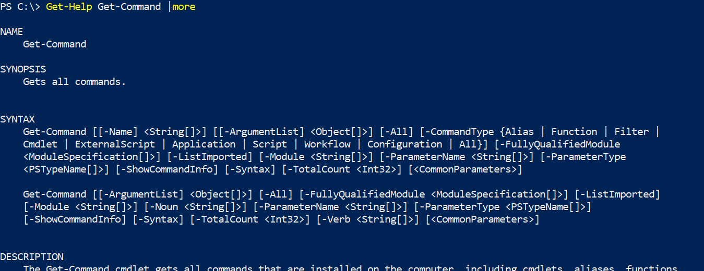

# PowerShell 

## PowerShell for Pentesters

# Table of Contents
1. [Basics](#basics)
2. [Cmdlets](#cmdlets)
    0. [Exploring and Using Cmdlets](#exploring-and-using-cmdlets)
        1. [Get-Command](#get-command)

    2. [Exercises](#exercises)
3. [Third Example](#third-example)

## Basics

Install **Update-Help** your computer. Enter **Y**

```Get-Help Get-Help -Examples |more```


Use **Get-Help** to retrieve help about **Get-Command**:

```Get-Help Get-Command |more```


Use **Get-Help about_[topic]** to retrieve help about **powershell.exe**:

```Get-Help powershell```


```Get-Help about_PowerShell.exe```


## Cmdlets

### Exploring and Using Cmdlets

#### Get-Command

**DESCRIPTION**
    The **Get-Command** cmdlet gets all commands that are installed on the computer, including cmdlets, aliases, functions,
    workflows, filters, scripts, and applications. Get-Command gets the commands from Windows PowerShell modules and
    snap-ins and commands that were imported from other sessions. To get only commands that have been imported into the
    current session, use the ListImported parameter.

```Get-Help Get-Command |more```




### Exercises


## Third Example